# PyNES Emulator

A NES (Nintendo Entertainment System) emulator written in 100% Python.

## Accuracy

and tests (untest = take too long or freeze out):

<div style="display: flex; gap: 10px;">
    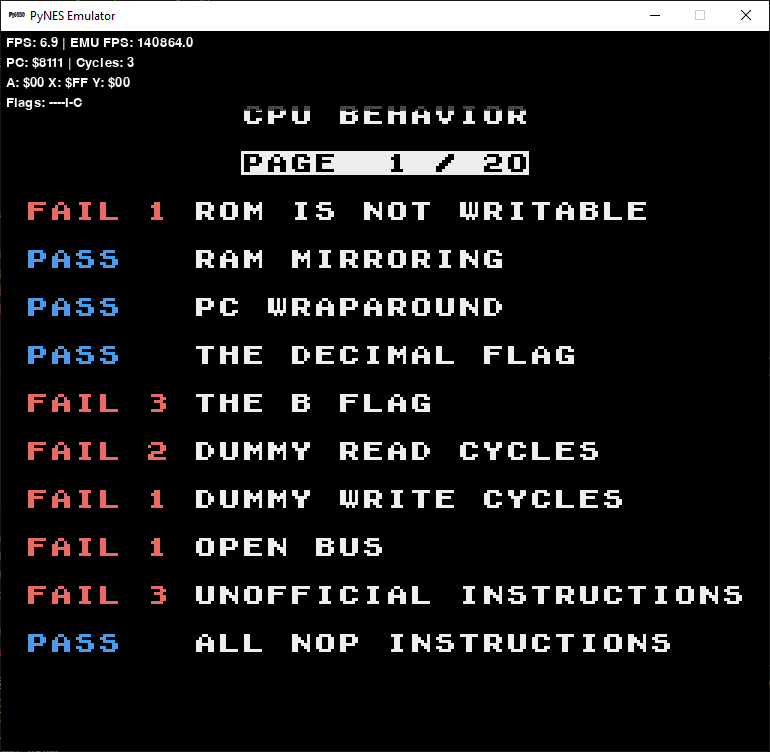
    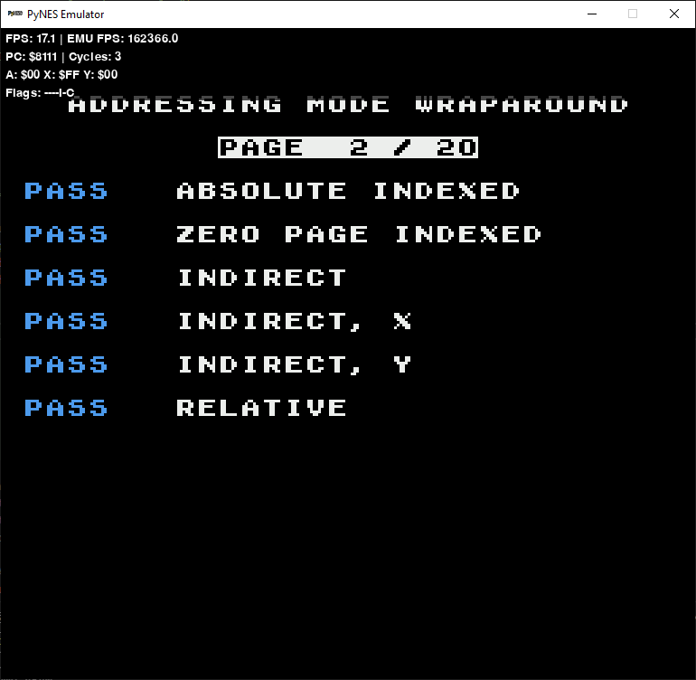
    
    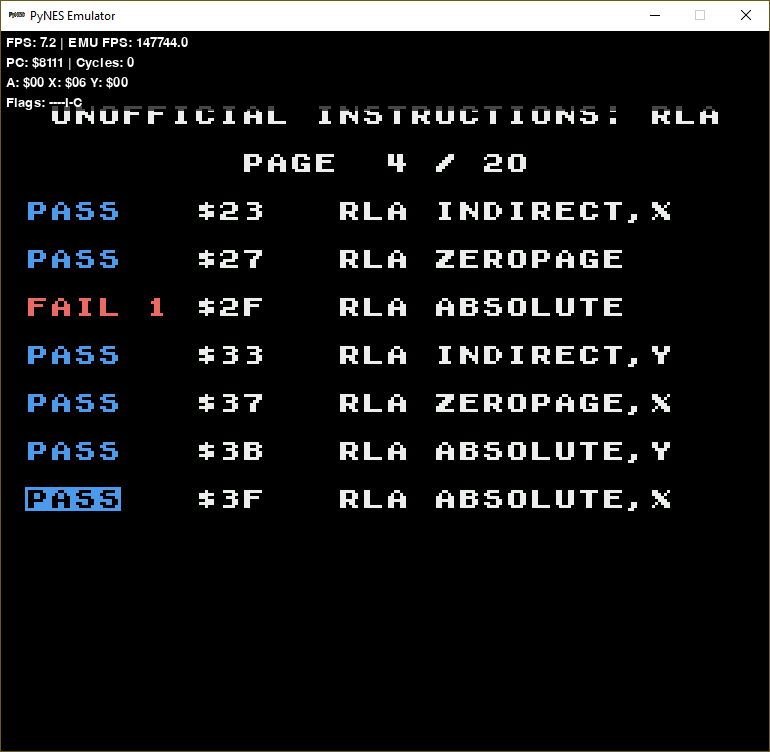
    
    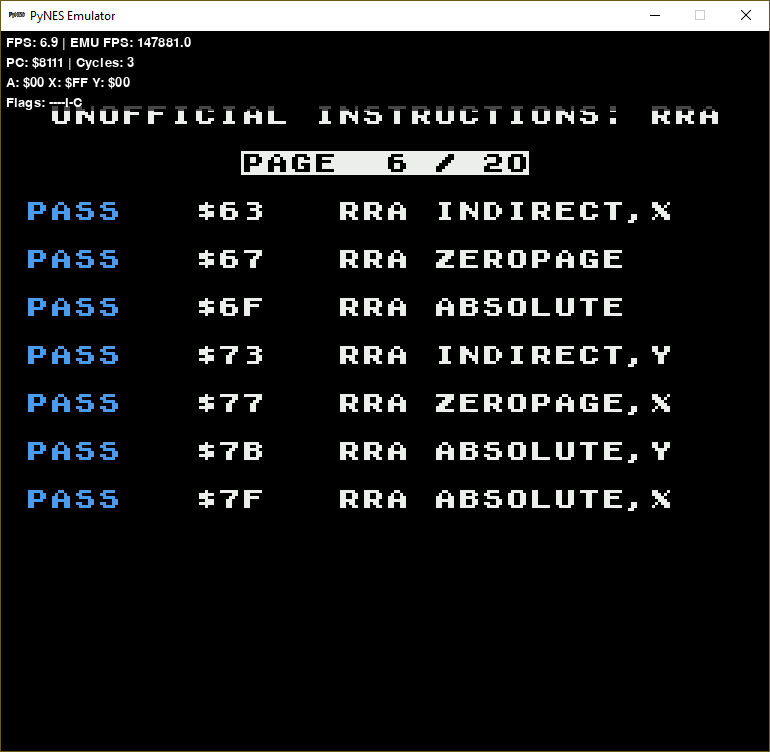
    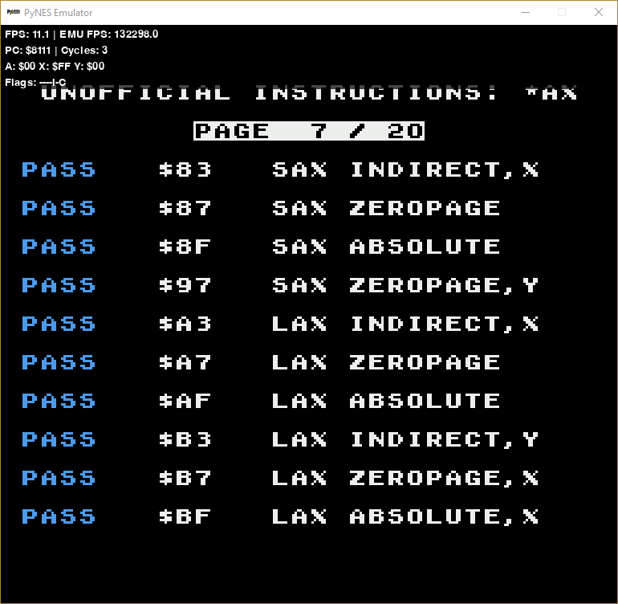
    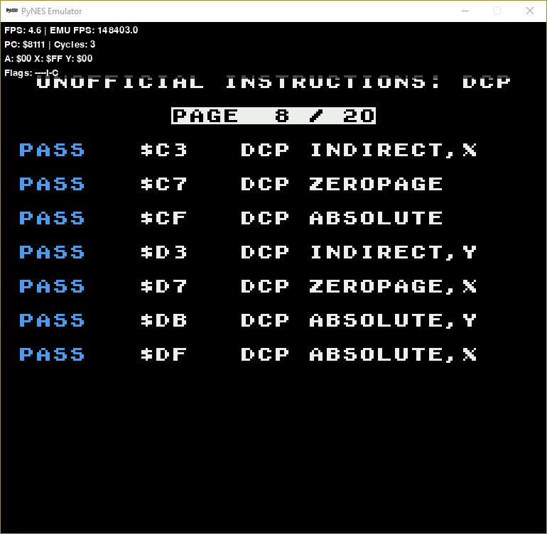
    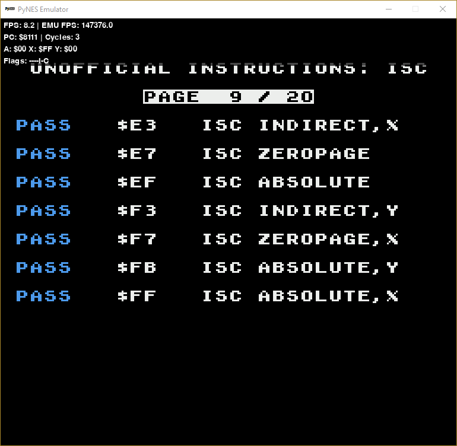
    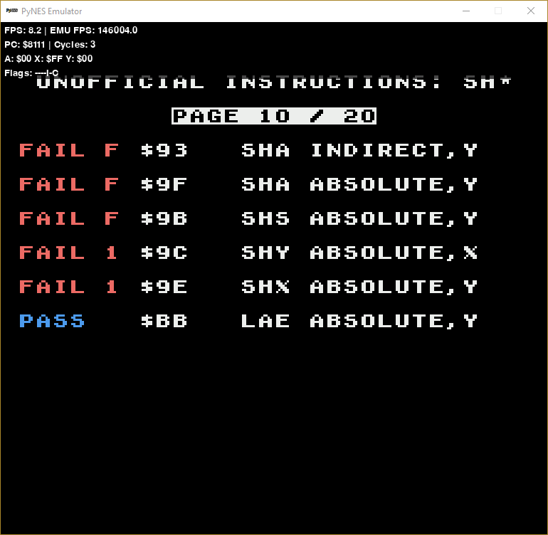
    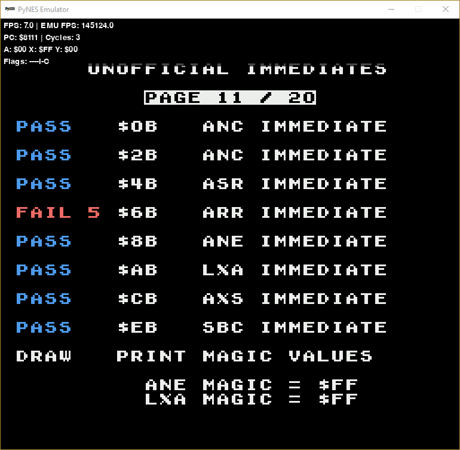
    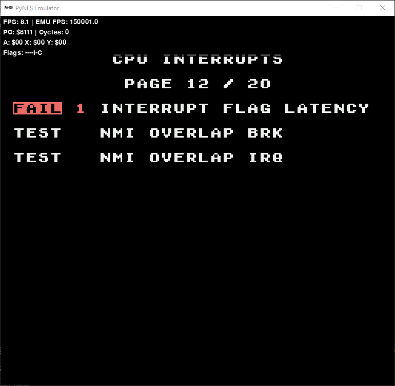
    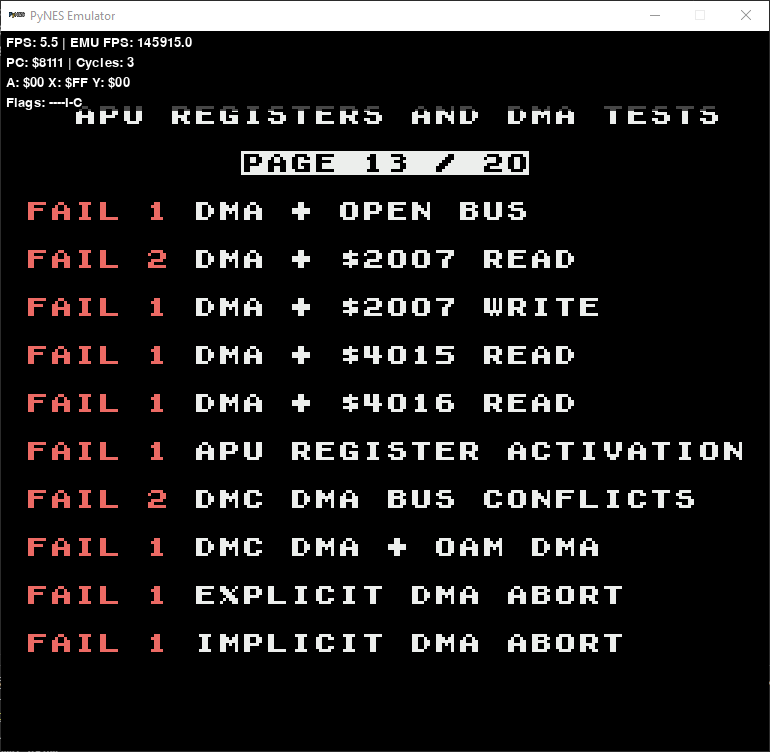
    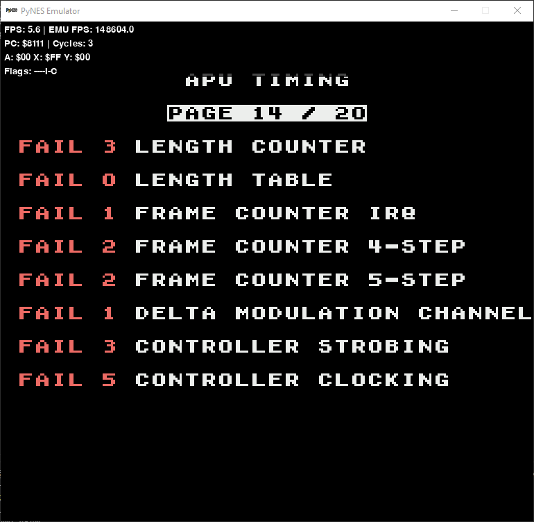
    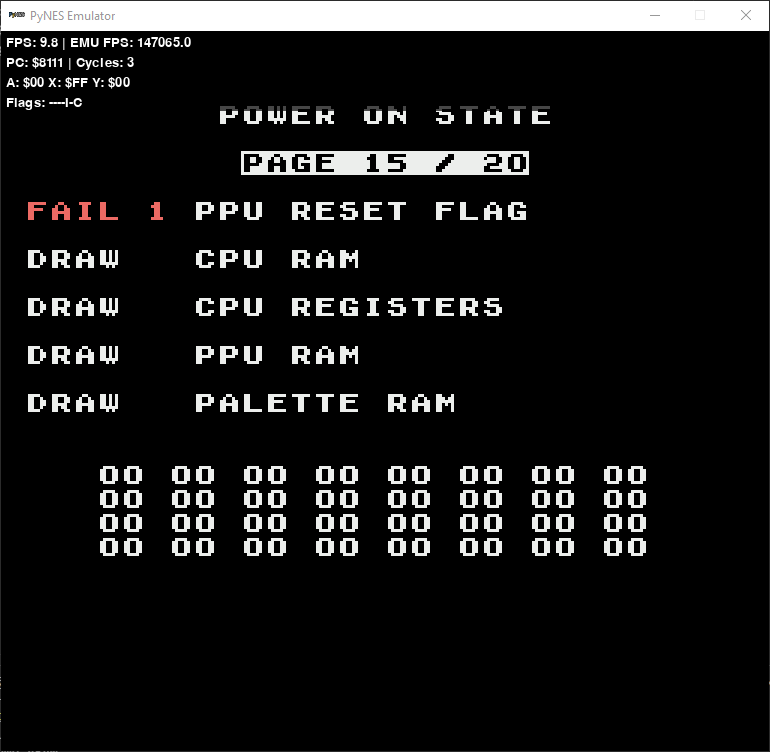
    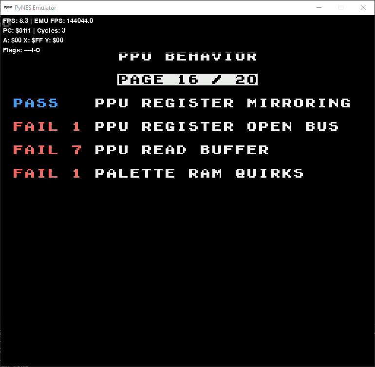
    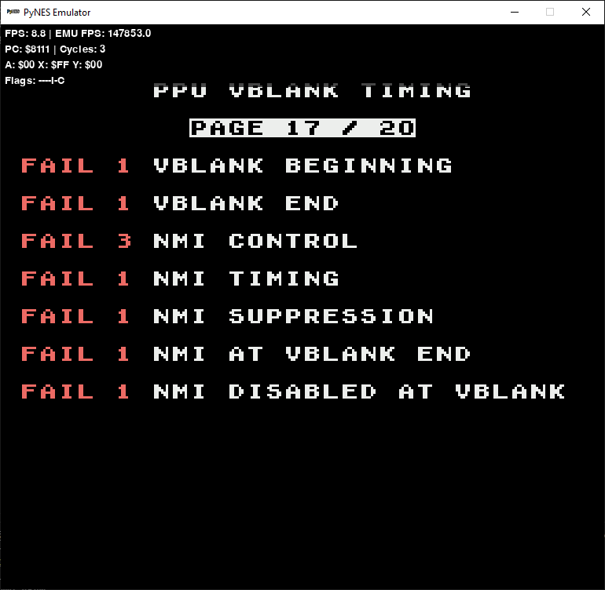
    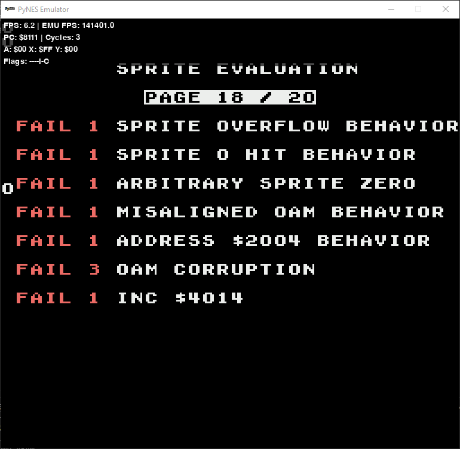
    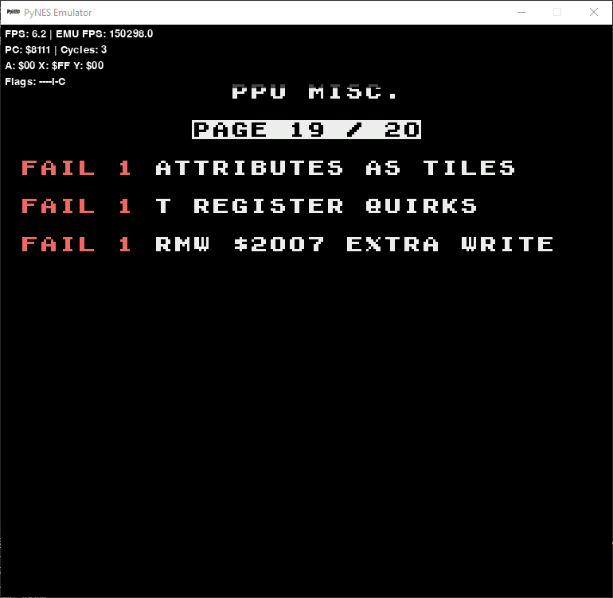
    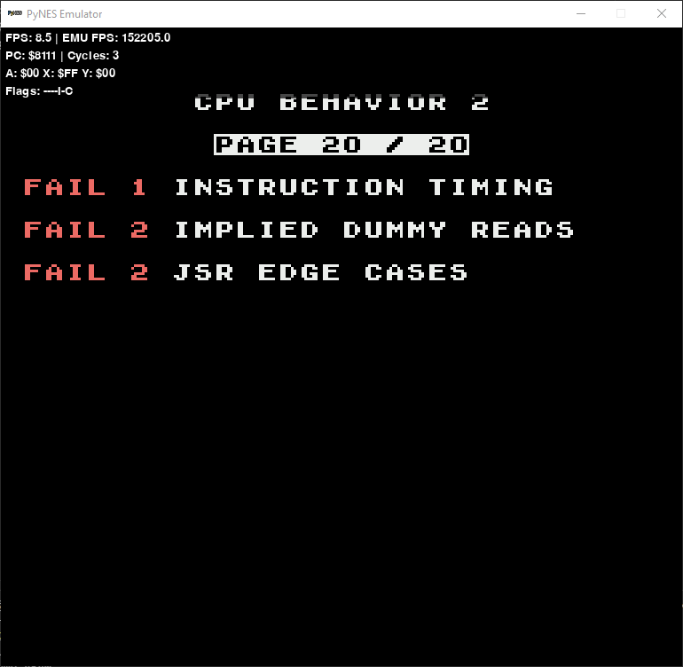
</div>

Not suitable for speedrunning at this time—please wait for future updates before using PyNES for these purposes.

here screenshot of emulator:

<div style="display: flex; gap: 10px;">
    
    
</div>

## Features (some work in progress)

- **CPU Emulation**: Partial implementation of the 6502 CPU instruction set.
- **PPU Emulation**: Basic PPU functionality for rendering graphics.
- **APU Emulation**: Basic sound emulation (work in progress).
- **Input Handling**: Keyboard input mapped to NES controller buttons.
- **ROM Loading**: Supports `.nes` ROM files.
- **Debugging**: Basic FPS and CPU register display.

## Current Status

The emulator can run simple NES ROMs like "Super Mario Bros.nes" and "AccuracyCoin.nes" (included for testing; "Super Mario Bros." is git-ignored due to copyright, only "AccuracyCoin.nes" is included). More complex games may not run correctly due to incomplete CPU and PPU implementations.

## Running the Emulator

1. Ensure you have Python 3.8 or higher installed.
2. Install the required dependencies using:
   ```bash
   pip install -r requirements.txt
   ```
3. Start the emulator with:
   ```bash
   python main.py
   ```
4. When prompted by the emulator, choose a `.nes` ROM file to load and play.

## Fix for me? ( Contributing )

Pull requests are welcome! If you want to contribute, please fork the repository and submit a pull request with your changes. Please test your code and submit it with a detailed description of the changes and screenshots of the test results.

## License

This project is licensed under the Apache License 2.0 - see the [LICENSE](LICENSE.md) file for details.
